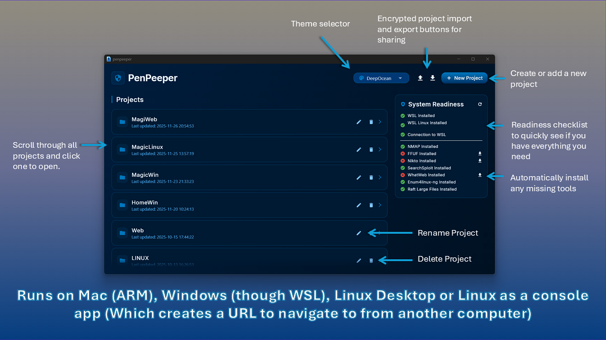
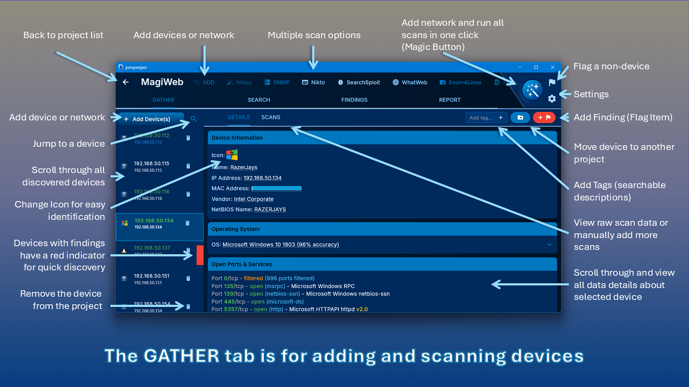
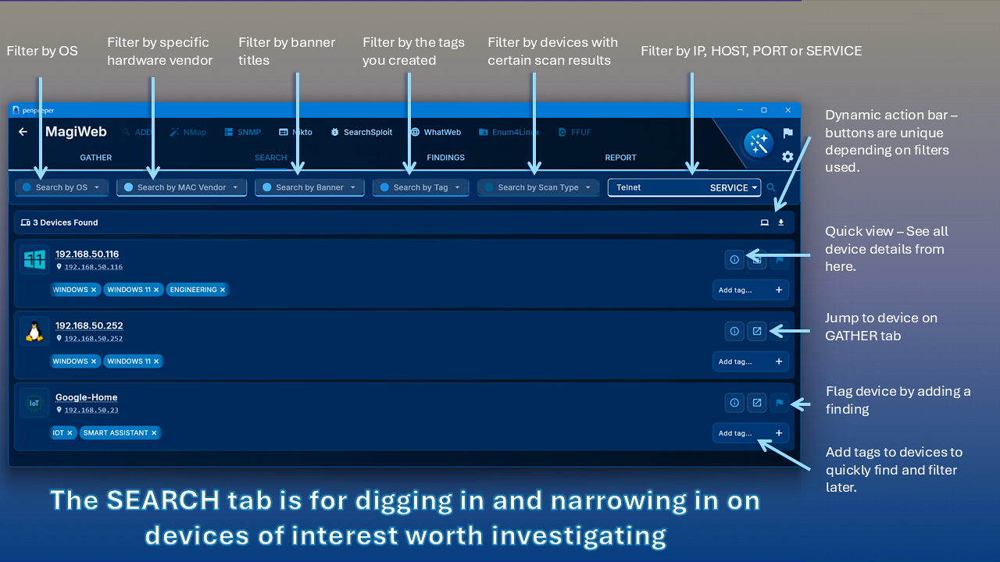
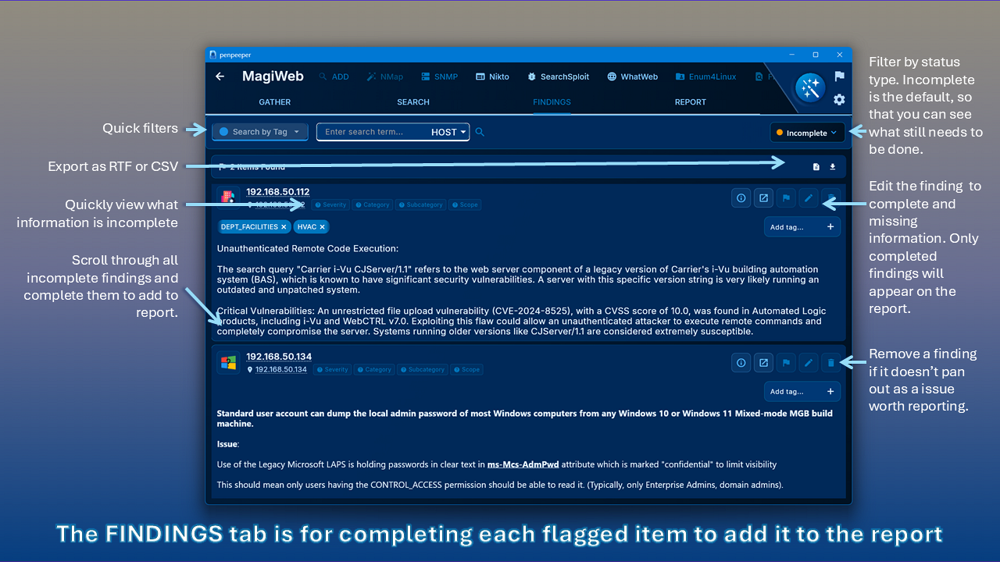

#   PenPeeper

> **Open Source Pentesting Engagement Manager with AI-Powered Vulnerability Hunting**

## What is PenPeeper?

**PenPeeper is an open source pentesting engagement management system** built for security professionals. It optionally combines local and external LLM integrations with automated scanning tools to streamline your entire workflow from reconnaissance to final report delivery.

### Core Capabilities
- **AI-powered vulnerability hunting** with support for LM Studio, Ollama, OpenRouter, Claude, Gemini, ChatGPT, and custom providers
- **Automated tool integration** for Nmap, Nikto, SearchSploit, WhatWeb, Enum4Linux, FFUF, and SNMP with intelligent scan parsing
- **NVD integration** to automatically pull CVE information and populate vulnerability details
- **Advanced search and organization** with powerful filtering, tagging, and multi-project management
- **Professional reporting** with AI-generated executive summaries and customizable templates

**Available for Windows, Mac, and Linux**

---

## 🚀 The Philosophy

PenPeeper eliminates the tedious parts of penetration testing so you can focus on what matters: **finding and exploiting vulnerabilities**.

Built around a logical, left-to-right workflow that mirrors the natural lifecycle of a pentest:

**`Gather` → `Search` → `Findings` → `Report`**

No more juggling multiple tools, manually parsing scan outputs, or wrestling with report formatting. PenPeeper handles the busywork while you concentrate on the security assessment.

---

## ✨ Key Features

### 🤖 AI-Powered Analysis
-   **LLM Integration**: Configure local or cloud AI providers for intelligent vulnerability analysis
-   **Automated Vulnerability Hunting**: Scan devices with AI-powered detection and configurable confidence/severity levels
-   **Evidence Examination**: AI searches device information and scans for existing proof of vulnerabilities
-   **Smart Recommendations**: Get best practice remediation guidance tailored to your findings
-   **Executive Summary Generation**: AI creates professional summaries based on all confirmed findings

### 🔍 Automated Scanning & Intelligence
-   **The "Magic Button"**: Automatically discover devices and run all built-in scans with a single click
-   **Tool Integration**: Built-in automation for Nmap, Nikto, SearchSploit, WhatWeb, Enum4Linux, FFUF, and SNMP
-   **Intelligent Parsing**: Scans are automatically analyzed and summarized—no manual parsing required
-   **NVD Integration**: Direct connection to the National Vulnerability Database for automatic CVE population
-   **Import Your Own**: Easily import scans from external tools, screenshots, and custom notes

### 📊 Organization & Workflow
-   **Intuitive Tab Navigation**:
    -   **Gather**: Add networks/devices, run scans, import evidence, and tag assets (e.g., Camera, Server, DMZ)
    -   **Search**: Hunt vulnerabilities by service, port, protocol, vendor, banner, or custom tags
    -   **Findings**: Track incomplete vs complete findings, assign categories with keyword filtering
    -   **Report**: Generate polished PDF reports with AI-assisted executive summaries
-   **Multi-Project Management**: Handle multiple engagements and clients simultaneously
-   **Tag System**: Organize by location, department, device type, or custom criteria for targeted reporting
-   **Encrypted Export**: Securely share entire projects with team members

### 🎨 Professional Reporting
-   **AI Executive Summaries**: Generate custom summaries based on severity and categories
-   **Smart Category Assignment**: Keyword filtering helps quickly classify vulnerabilities
-   **Custom Graphics**: Choose from multiple professional chart styles for vulnerability visualization
-   **Guided Templates**: Built-in help with descriptions and examples for every report section
-   **Rich Text Editor**: Professional formatting with custom vulnerability classifications

### 🛠️ Additional Features
-   **Concurrent Scanning**: Configure simultaneous scan limits to balance speed with network impact
-   **Built-in Telnet Client**: Connect directly to devices for verification without switching tools
-   **Customizable Themes**: Multiple dark and light themes for your preference
-   **Scan Tracking**: Visual indicators prevent accidental scan reruns
-   **Multi-Platform**: Native support for Windows, Mac, and Linux
## 📦 Compiled Downloads

* Download the latest release from the Releases page...








## 🛠️ How to Use

### If you want to run on Linux without a desktop then run the command:
   ```bash
   ./penpeeper --term
   ```
Then (Navigate to web page at http://YOUR_LINUX_IP:8808/ from another computer.


### 1. Gather
Start by adding your scope.
-   **Magic Button**: Perfect for single network ranges. Adds and scans everything automatically.
-   **Manual Control**: Add devices individually or "Add Device(s)" to populate the list, then scan selected targets at your pace.

### 2. Analyze & Import
-   Drill down into device **Details** or view raw **Scan** results.
-   Import external evidence (screenshots, logs) directly into the device record.

### 3. Flag Findings
-   Found something? Click the red **"Add Flag"** button.
-   This creates an entry in your **Findings** tab for later review.

### 4. Search & Refine
-   Use the **Search** tab to hunt for specific vendors, outdated services, or forgotten endpoints.
-   Use the **Findings** tab to complete the details for every flagged item.

### 5. Report
-   Once findings are complete, head to the **Report** tab.
-   Select a summary graphic, fill in the executive summary using the built-in helper text, and export your polished PDF.


## Build Instructions
[Full flutter project build instructions](BUILD_INSTRUCTIONS.md)

## 🤝 Contributing
Contributions, issues, and feature requests are welcome!

## 📝 License
[License: Apache 2.0 with Commons Clause](License.md)
**What this means:**
- ✅ You can use this for free for personal or professional work.
- ✅ You can modify the code and share those modifications for free.
- ❌ You **cannot** sell this software, or a modified version of it, without explicit permission.
- ❌ You **cannot** host this as a paid service (SaaS).

### brand icons
### [Brand icons created by Pixel perfect - Flaticon](https://www.flaticon.com/free-icons/brand)

## 🔎 Keywords
pentesting, penetration testing, cybersecurity, infosec, ethical hacking, 
AI security, vulnerability management, pentest reporting, LLM integration, 
open-source security tools